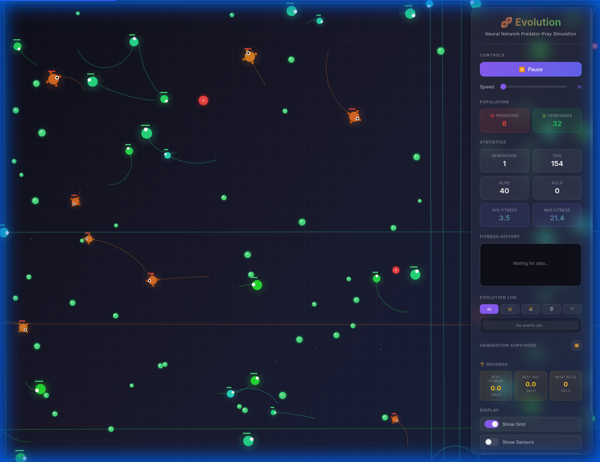

# 🧬 Neural Network Life Simulation

A web-based evolutionary simulation where creatures evolve neural networks to survive and reproduce. Built with Vanilla JavaScript and Vite.

[](https://opensource.org/licenses/MIT)
[](https://github.com/s1awek/life-simulation/actions)
[](https://github.com/s1awek/life-simulation/graphs/commit-activity)
[](http://makeapullrequest.com)
[](https://life-simulation-two.vercel.app/)



## 📖 Table of Contents
- [Overview](#-overview)
- [Quick Start](#-quick-start)
- [Simulation Mechanics](#-simulation-mechanics)
- [Controls & Interactions](#-controls--interactions)
- [Technical Architecture](#-technical-architecture)
- [Contributing](#-contributing)
- [Author](#-author)

## 🌟 Overview

[**🔴 Play the Live Demo**](https://life-simulation-two.vercel.app/)

This project simulates a closed ecosystem where simple organisms (creatures) compete for food and survival. Each creature has a unique **Neural Network (Brain)** that dictates its movement and actions based on sensory input. Through **Genetic Algorithm (Evolution)**, the fittest creatures—those that eat enough food to survive—pass their genes (neural weights and physical traits) to the next generation.

### Key Features
- **Neural Network Brains**: Creatures use a feedforward neural network to process inputs (food location, other creatures) and decide how to move.
- **Genetic Evolution**: Successful creatures reproduce. Offspring inherit traits and brain weights with mutations, leading to smarter behaviors over time.
- **Dynamic Traits**: Creatures have variable traits like **Size**, **Speed**, **Metabolism**, and **Vision Radius**.
- **Predator & Prey Ecosystem**: Dynamic predator-prey balance with cannibalism prevention and intelligent hunting.
- **Map Obstacles**: Rocks and barriers create strategic depth - prey can hide, predators must navigate.
- **Ecosystem Balancing**: Dynamic food scarcity, overpopulation penalties, and meat expiration incentivize active hunting.
- **Save & Load**: Persist your simulation state to JSON and resume experiments later.
- **Customizable Settings**: Configure population size, food density, and generation length.
- **Zoom & Pan Controls**: Explore the 2x larger world with mouse drag, WASD keys, or mouse wheel zoom.
- **Real-time Visualization**: Watch the evolution happen with interactive charts tracking fitness and population ratios.

## 🚀 Quick Start

Get the simulation running in minutes!

### Prerequisites
- [Node.js](https://nodejs.org/) (v14 or higher)
- npm

### Installation & Run

1.  **Clone and Install:**
    ```bash
    git clone <repository-url>
    cd life-simulation
    npm install
    ```

2.  **Start Simulation:**
    ```bash
    npm run dev
    ```

3.  **View:** Open `http://localhost:5173` in your browser.

### Build for Production
```bash
npm run build
```

## 🧠 Simulation Mechanics

### 1. The Creature
Each creature is an autonomous agent with the following properties:
- **Sensors**: Ray-casting sensors to detect food (Green) and other creatures (Red/Blue).
- **Brain**: A simple Neural Network taking sensor data as input and outputting movement commands (speed, turn angle).
- **Energy**: Consumed over time and by moving. Refilled by eating food (Green particles). If energy hits 0, the creature dies.

### 2. Genetics & Traits
Creatures are not identical. They have genetic traits that affect their physical capabilities:
- **Size**: Larger creatures are stronger but slower and need more food.
- **Metabolism**: Higher metabolism allows faster movement but drains energy quicker.
- **Vision**: Determines how far a creature can "see".
- **Aggression**: Determines if a creature is likely to be a predator.

### 3. Hunting & Food System
**Meat Types:**
- **Herbivore meat** 🔴: Red, edible for predators, spawns when herbivores die
- **Predator meat** 🟣☠️: Purple with skull, toxic to other predators (prevents cannibalism)

**Meat Expiration:**
- **Hunted meat**: Lasts 800 ticks (incentivizes active hunting)
- **Starvation meat**: Lasts 300 ticks (spoils faster)
- **Plants**: Never expire

### 4. Map Obstacles
Rocks and barriers scattered across the map:
- **Strategic gameplay**: Prey can hide behind obstacles
- **Collision detection**: Creatures bounce off and turn around
- **Spatial dynamics**: Creates territories and safe zones

### 5. Evolution Cycle & Balancing
The simulation runs in **Generations** of 20,000 ticks each.

**Generation Flow:**
1.  **Generation Start**: Population spawns (25% predators, 75% herbivores)
2.  **Live Phase**: 20,000 ticks of hunting, eating, and survival
3.  **Dynamic Balancing**: Food scarcity increases when herbivores overpopulate (>65%)
4.  **Overpopulation Penalties**: Dominant species get -20% fitness penalty
5.  **Selection**: Top performers selected based on fitness
6.  **Reproduction**: Elite creatures + mutated offspring form next generation

**Ecosystem Balancing:**
- **Dynamic food spawning**: Fewer plants when herbivores dominate
- **Enhanced hunting rewards**: 150 base + kill streak bonuses
- **Population penalties**: Prevents monocultures

### 6. Fitness & Selection System

#### 📊 Fitness Calculation
Each creature accumulates fitness points throughout its lifetime:

**Base Fitness (All Creatures):**
- **+0.01 per tick survived** - Rewards longevity
- **+Food energy** when eating (5-20 for plants, 20-45 for meat)
- **+Remaining energy** at generation end (if alive)

**Predator Bonuses:**
- **+150 points** per kill (base reward)
- **+50% of prey's fitness** (rewards hunting strong prey)
- **+20 × kill count** (progressive bonus - encourages kill streaks)

**Penalties:**
- **-15% to -20%** fitness if species overpopulates (maintains balance)

#### 🧬 Genetic Algorithm Selection

The selection process uses a combination of **Elitism** and **Tournament Selection**:

##### A. Elitism (Top 10%)
```
elitismRate = 0.1  (10% of population)
```
- The **top 10% fittest creatures** pass directly to the next generation **unchanged**
- Exact copies: same neural network weights, same genetic traits
- Marked with golden crown in UI
- **Guarantees**: Best solutions are never lost, avg fitness never decreases

**Example:** With 40 creatures → **4 elites** clone directly

##### B. Tournament Selection (Remaining 90%)
For each offspring position:

**1. Parent Selection (Tournament of 5)**
```
tournamentSize = 5
```
- Randomly pick 5 candidates from population
- Select the one with highest fitness
- Repeat to get second parent
- This gives better creatures higher chance while maintaining diversity

**2. Crossover (Genetic Mixing)**
- **Neural network weights**: Each of 744 weights randomly inherited from parent 1 or 2 (50/50)
- **Genetic traits**: Each trait (size, metabolism, vision, etc.) from random parent
- **Predator/Prey type**: From random parent + **5% chance to flip type**

**3. Mutation (Innovation)**
```
mutationRate = 0.1        (10% chance per weight)
mutationStrength = 0.3    (±30% adjustment)
traitMutationRate = 0.15  (15% chance per trait)
```
- **Neural weights**: 10% of weights get Gaussian noise added (±0.3)
- **Genetic traits**: 15% of traits mutate (±20% of value)
- Enables discovery of new strategies and prevents local optima

#### 🎯 Why This Works

**Tournament Selection Benefits:**
- ✅ Stronger creatures have higher reproduction probability
- ✅ Weaker creatures still have small chance (genetic diversity)
- ✅ Avoids "inbreeding" (all offspring from same 2 parents)
- ✅ Efficient: O(n) complexity

**Elitism Guarantees:**
- ✅ Best solutions preserved each generation
- ✅ Convergence: fitness can only stay same or improve
- ✅ Stability: prevents random catastrophic performance drops

**Mutation Exploration:**
- ✅ Discovers new neural network configurations
- ✅ Escapes local fitness maxima
- ✅ Adapts to changing ecosystem conditions

#### 📈 Selection Example

Starting population of 40 creatures with fitness scores:
```
Rank  Fitness  Fate
1     800      → Elite (clone)
2     650      → Elite (clone)
3     600      → Elite (clone)
4     550      → Elite (clone)
5-40  500-20   → Tournament pool for breeding
```

Next generation composition:
- **4 elites** (exact clones of top 4)
- **36 offspring** created via tournament selection + crossover + mutation

A weak creature (fitness: 50) has only ~5% chance to be selected in any tournament, so it rarely reproduces. A strong creature (fitness: 600) is chosen in ~80% of tournaments it's in.

## 🎮 Controls & Interactions

### Mouse Controls
- **Left Click**: Select/deselect creature to view stats
- **Right Click + Drag**: Pan camera around the world
- **Middle Click + Drag**: Alternative pan control
- **Mouse Wheel**: Zoom in/out (50%-200%)

### Keyboard Controls
- **Spacebar**: Pause/unpause simulation
- **WASD / Arrow Keys**: Pan camera
- **+ / -**: Zoom in/out
- **0 (zero)**: Reset camera to center

### UI Controls
- **Speed Slider**: Adjust simulation speed (1x-10x)
- **Zoom Buttons**: -/100%/+ for precise zoom control
- **Show All Stats**: When paused, show tooltips for all creatures
- **Log Filters**: Filter evolution log by event type
- **Display Toggles**: Grid, sensors, and tooltip visibility

## 🛠️ Technical Architecture

### Project Structure
```
src/
├── engine/           # Core simulation logic
│   ├── NeuralNetwork.js   # Brain implementation (Matrix math)
│   ├── GeneticAlgorithm.js # Evolution, mutation, crossover logic
│   ├── Traits.js          # Physical traits system
│   └── EvolutionLog.js    # Statistics tracking
├── world/            # Game entities
│   ├── World.js           # Main container for entities
│   ├── Creature.js        # The agent logic
│   └── Food.js            # Resources
├── renderer/         # Visualization
│   └── Renderer.js        # HTML5 Canvas drawing logic
├── ui/               # User Interface
│   └── UI.js              # DOM manipulation for stats/charts
└── main.js           # Entry point and loop
```

### Technologies Used
- **Vanilla JavaScript (ES6+)**: Core logic, no heavy frameworks.
- **HTML5 Canvas**: High-performance 2D rendering.
- **Vite**: Fast development build tool.
- **Custom Canvas Charts**: Lightweight visualization using Canvas API for population stats.
- **PixiJS** (Experimental): Optional WebGL renderer for improved performance (available in source).

## 🖥️ UI & User Experience

### Interactive Inspection
The simulation allows you to inspect individual creatures:
- **Click to Select**: Click on any creature to select it
- **Visual Feedback**: Pulsing white dashed ring highlights selected creature
- **Live Stats Panel**: Tooltip showing energy, fitness, kills, and genetic traits

### Camera Controls 🎮
- **Zoom**: Mouse wheel, +/- keys, or UI buttons (50%-200%)
- **Pan**: 
  - WASD or Arrow keys
  - Right-click drag on canvas
  - Middle-click drag
- **Reset**: Press 0 to center camera at 100% zoom
- **World Size**: 2x window size for more exploration space

### Main Dashboard
The right-side panel provides comprehensive statistics:
- **Controls**: Pause/Play, speed adjustment (1x-10x), zoom buttons
- **Population Stats**: Real-time predator vs herbivore counts
- **Statistics**: Generation, tick, alive count, kills
- **Fitness History**: Chart tracking avg/max fitness over 50 generations
- **Population Trend**: NEW! Red/green lines showing predator/prey ratios
- **Evolution Log**: Filterable log (births, deaths, kills, elites)
- **Generation Survivors**: Breakdown of elite creatures and offspring
- **Records**: Best-ever fitness, kills, and generation numbers

### Save & Load System 💾
- **Save State**: Click the **Floppy Disk** icon to download a JSON file containing the complete simulation state.
- **Load State**: Click the **Folder** icon to upload a previously saved JSON file and resume your experiment.
- **Data Persisted**: Preserves all creatures (neural networks & traits), world statistics, and evolution history.

### Configuration ⚙️
Click the **Gear Icon** to start a new simulation with custom parameters:
- **Population Size**: 20 to 300 creatures
- **Food & Meat Count**: Adjust resource abundance
- **Obstacles**: Set map complexity (0-100)
- **Generation Length**: Set how long generations last (500-30,000 ticks)
- **Predator Ratio**: Set initial predator percentage (0-50%)

## 🤝 Contributing

Contributions, issues, and feature requests are welcome!
Feel free to check the [issues page](https://github.com/s1awek/life-simulation/issues).

1.  Fork the Project
2.  Create your Feature Branch (`git checkout -b feature/AmazingFeature`)
3.  Commit your Changes (`git commit -m 'Add some AmazingFeature'`)
4.  Push to the Branch (`git push origin feature/AmazingFeature`)
5.  Open a Pull Request

## 🌟 Support

If you like this project, please give it a **star** ⭐!

## 👨‍💻 Author

Created by [WellMade](https://wellmade.online).
Source code available on [GitHub](https://github.com/s1awek/life-simulation/).
